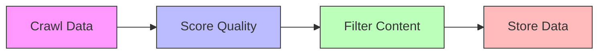

# 🎯 Fortune Cookie Data ETL Pipeline

[](https://www.python.org/downloads/)
[](https://pydantic-docs.helpmanual.io/)
[](https://github.com/psf/black)

> A powerful, modular data pipeline for collecting, evaluating, and storing high-quality fortune cookie content.

---

## 🏗️ Architecture Overview

The system follows the classic ETL (Extract, Transform, Load) architecture, with each stage carefully designed to ensure data quality and processing efficiency.

### 📥 Extract Stage

The extraction stage is built around a flexible crawler system that can collect data from multiple sources:

```
extract/
├── 🌐 crawler.py      # Base crawler implementation
├── 🔄 extractor.py    # Generic extractor interface
└── 📚 gushiwen.py     # Specialized crawlers
```

**Core Components:**

🔹 `Crawler`
- Common web scraping functionality
- Intelligent request management
- Robust error handling

🔹 **Specialized Implementations**
- `MingJuCrawler`: Famous quotes collector
- `GuShiCrawler`: Poetry content crawler
- `ShiWenCrawler`: Literary works collector
- `GushiwenCrawler`: Main crawler orchestrator

### 🔄 Transform Stage

The transformation stage implements a multi-step pipeline for data processing:

```
transform/
├── 🔄 transformer.py  # Base transformer interface
├── ⭐ scorer.py      # Quality scoring system
└── 🎯 filter.py      # Content filtering implementations
```

**Key Features:**

🔹 `Transformer`
- Foundation for all transformation operations
- Chain processing support
- Type safety guarantees

🔹 `Scorer` System
- 📊 Overall quality assessment
- 🌟 Popularity analysis
- 🎭 Sentiment analysis
- 📝 Content clarity evaluation

🔹 **Filtering Strategies**
- `FilterByLength`: Length validation
- `FilterByScore`: Quality threshold
- `FilterByRank`: Ranking-based selection

### 💾 Load Stage

The loading stage provides a flexible storage system:

```
load/
├── 📦 loader.py    # Generic loader interface
├── 📄 jsonl.py     # JSONL file storage
└── 🗃️ cookiedb.py  # Specialized cookie database
```

**Core Features:**

🔹 Generic Loading Interface
- Parameterized type design
- Extensible storage backends
- Data integrity guarantees

## 📊 Data Model

The system uses a hierarchical data model:

```python
class Cookie:
    title: str       # Title
    author: str      # Author
    content: str     # Content
    source: str      # Source
    link: str        # Link
    evaluations: Score  # Quality scores

class CookieJar:
    name: str              # Name
    link: str             # Link
    cookies: List[Cookie]  # Cookie list
    language: str         # Language
    tags: List[str]       # Tags
    format: str           # Format
```

## 🔄 Processing Flow



1. **📥 Data Collection**
   - Intelligent crawling
   - Structured parsing
   - Source tracking

2. **⚡ Data Processing**
   - Quality scoring
   - Multi-stage filtering
   - Metadata enrichment

3. **💾 Data Storage**
   - Persistent storage
   - Incremental updates
   - Integrity validation

## 🚀 Usage Guide

### Complete ETL Process

```python
from scripts.main import main

# Launch full processing pipeline
main()
```

### Partial Processing (Transform & Load Only)

1. Configure tasks in `tasks.jsonl`
2. Pipeline will skip extraction phase

## ⚙️ Configuration

| Config File | Purpose |
|-------------|---------|
| `.env` | Environment variables |
| `tasks.jsonl` | Task definitions |
| `model_config/` | Model configurations |

## 🎯 Quality Assurance

Built-in multi-layer quality assurance:

✅ Source validation  
✅ ML-powered quality scoring  
✅ Multi-stage filtering  
✅ Data integrity checks  

Ensures high standards in:
- 📚 Content relevance
- 🎯 Language quality
- 🌟 Cultural significance
- ⚡ Technical accuracy

---

<div align="center">

**🌟 Building High-Quality Cultural Dataset 🌟**

</div>
